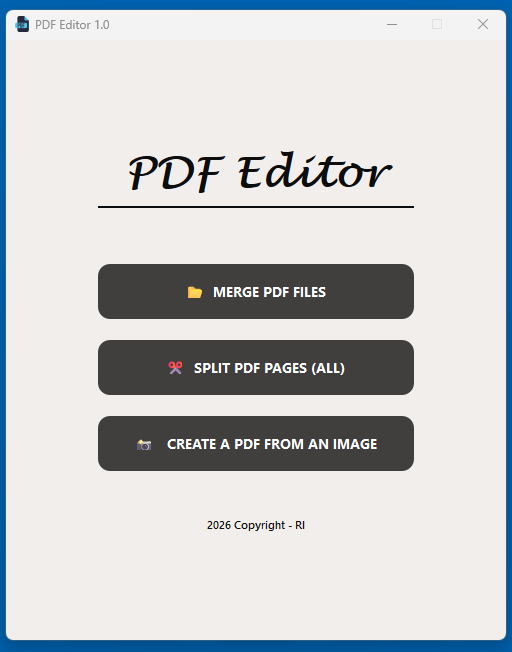

# PDF Editor Pro 1.0

A modern and lightweight PDF management tool built with Python and PyQt6.

## 🚀 Features
* **Merge PDFs:** Combine multiple PDF files easily.
* **Split PDFs:** Separate all pages of a PDF into individual files.
* **Image to PDF:** Convert JPG, PNG, and JPEG images into A4 PDFs.
* **Modern UI:** Clean interface with Windows dark title bar support.

## 🛠️ How to Use
1. Install requirements: `pip install -r requirements.txt`
2. Run the app: `python main.py`

## ⚖️ License & Credits
* This project is licensed under the **MIT License**.
* Icon provided by [Flaticon](https://www.flaticon.com). Link: https://www.flaticon.com/free-icon/pdf_9407347?term=pdf&page=7&position=10&origin=search&related_id=9407347
* Developed by [i-rahim] - 2026.
   
   